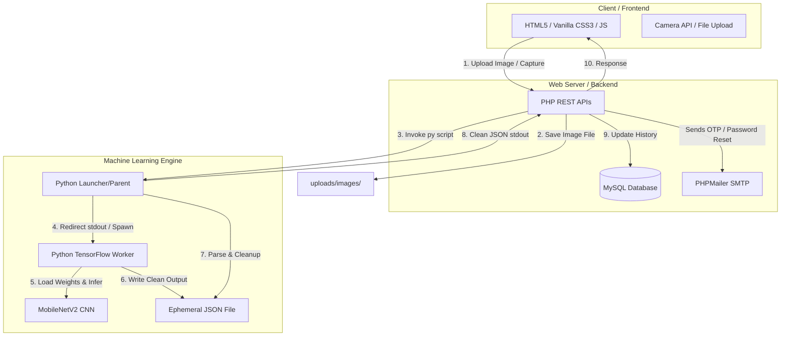

# visit this link for testing the website
https://dogbreedfinder.gt.tc

# 🐾 Dog Breed Classifier (formerly PawDetect)

An engineering-focused, AI-powered web application that identifies dog breeds instantly using deep learning, paired with a comprehensive suite of dog care tools including an adoption marketplace, personalized nutrition planner, behavioral training tracker, and vaccination schedule scheduler.

---

## 🏗️ System Architecture Overview

This project is built using a hybrid architecture that bridges high-performance deep learning inference (Python + TensorFlow) with a robust, secure, and light-weight relational web backend (PHP + MySQL).



---

## 🛠️ Tech Stack & Engineering Breakdown

### 1. Machine Learning & Algorithms
*   **Core Model**: **MobileNetV2** (pre-trained on ImageNet).
    *   *Why MobileNetV2?* It is an efficient, lightweight Convolutional Neural Network (CNN) that uses depthwise separable convolutions and inverted residuals to provide high classification accuracy with low computational latency, making it ideal for real-time web deployment on CPUs.
*   **Libraries**: Python 3.10+, `tensorflow` (TensorFlow 2.x/Keras), `numpy`, `pillow` (PIL).
*   **Classification Reach**: Pre-trained weights classify inputs against the **120 dog breed categories** defined in the ImageNet WordNet Synsets (e.g., *Chihuahua, Golden Retriever, Siberian Husky, Labrador Retriever*, etc.).

### 2. Backend & Database Engineering
*   **Server Logic**: **PHP 8.x** (Structured, modular, utilizing secure HTTP headers, custom middleware for session validation, and JSON API routing).
*   **Database**: **MySQL 8.0** (Relational layout with optimized database indexes for high-read fields like email, session tokens, and timestamps; foreign-key constraints with cascade deletions).
*   **Communication Services**: Native SMTP integration via **PHPMailer** for executing secure sign-ups using OTP (One-Time Passwords) and password reset emails.

### 3. Frontend & Visual Design
*   **User Interface**: Built with semantic **HTML5**, modern **Vanilla CSS3**, and **JavaScript (ES6+)**.
*   **Design System**: Implemented a responsive grid system, micro-interactions, dark modes, glassmorphism overlays, and smooth CSS transitions. The interface is optimized to perform seamlessly on both desktop screens and mobile viewports.

---

## 🌟 Core Technical Highlights

### ⚡ Subprocess Purity Architecture (Stdout Separation)
**The Problem:** During the initialization of TensorFlow/Keras libraries (especially on the first run when weights are checked or downloaded), TensorFlow prints initialization info, GPU support alerts, and download progress bars directly to the standard output (`stdout`). If the PHP backend runs the python script using a standard shell capture, this noise mixes with the final JSON result, leading to parsing failures (`Could not parse CNN output`).

**The Solution:** The python script `dog_breed_detector.py` implements a parent-worker subprocess pattern:
1. The script is called by PHP as the Parent.
2. The Parent launches a copy of itself as a Child worker (`--_worker` mode) but redirects the child's `stdout` to `/dev/null` (or `nul` on Windows) at the OS level.
3. The Child worker loads TensorFlow, performs inference, and writes the structured result to a secure, dynamically generated ephemeral JSON file.
4. The Parent reads the temp file, deletes it, and outputs *only* the pristine JSON string back to PHP's `shell_exec`.

### 🛡️ Smart Classification Guard (False Positive Prevention)
To ensure the app does not misidentify random objects, humans, or cats as dog breeds, a dual-layer filtering logic is applied:
1. **Dog Synset Membership**: Predictions are mapped against the 120 known ImageNet dog synsets.
2. **Dynamic Overriding Threshold**:
    *   If the top global ImageNet prediction is a dog, the classification threshold is set to `15%` confidence.
    *   If the top global prediction is **not** a dog (e.g., a laptop, a cup, or a cat), the required total confidence score of the dog predictions is automatically escalated to **`40%`**. If it falls below this, the system flags the image as `NOT_A_DOG` and halts classification, returning a clean error message: *"The picture is not matching."*

---

## 📁 Repository Structure

```text
dog_breed_classifier/
├── assets/                     # Static UI assets
│   ├── css/                    # Custom styling sheet (index.css)
│   ├── js/                     # Shared frontend routing & handlers (main.js)
│   ├── data/                   # Static app metadata
│   └── img/                    # Interface icons, logos, and illustration assets
├── backend/                    # Server-side logic layer
│   ├── api/                    # RESTful PHP API Endpoints
│   │   ├── breed_info.php      # Retrieves detailed breed specifications
│   │   ├── login.php           # User authentication
│   │   ├── register_otp.php    # OTP registration logic
│   │   ├── predict.php         # Secure bridge invoking the Python ML engine
│   │   ├── save_scan.php       # Persists scan results to database
│   │   └── profile.php         # Profile details and image uploads
│   ├── core/                   # System constants & setup
│   │   └── config.php          # Database links, SMTP configs, and global helper functions
│   ├── database/               # Database files
│   │   └── database_setup.sql  # Relational MySQL Schema scripts
│   └── scripts/                # Machine Learning scripts
│       ├── dog_breed_detector.py # MobileNetV2 CNN classifier (with worker redirection)
│       └── imageupload.py      # Script helper for uploading validation
├── frontend/                   # Client-side presentation layer
│   ├── home_page.html          # Main landing entry
│   ├── detect.html             # Camera & image uploader AI detector dashboard
│   ├── adoption_module.html    # Peer-to-peer adoption and listings hub
│   ├── food_module.html        # Nutritional guides
│   ├── behavior_module.html    # Behavioral training recommendations
│   ├── vaccination_module.html # Vaccination tracker and schedule generator
│   ├── list_your_dog.html      # Adoption listing registration
│   ├── login_page.htm          # Auth login view
│   └── register.html           # Auth register view
├── uploads/                    # User image uploads directory (scans & dog listing photos)
├── vendor/                     # Backend components (PHPMailer source integration)
├── index.php                   # Redirect router
└── README.md                   # Project documentation
```

---

## 💾 Relational Database Schema

The system runs on **MySQL** with six primary tables, maintaining strict integrity constraints:
*   `users`: Stores user info, hashed password strings, and timestamps.
*   `otp_verifications`: Tracks verification hashes, expiration timers, and registration details for secure sign-ups.
*   `password_resets`: Handles reset tokens linked directly to user accounts.
*   `user_sessions`: Manages active login session tokens, user agents, and IP addresses.
*   `scan_history`: Preserves user dog breed classification scans, image paths, breed names, and confidence levels.
*   `dog_listings`: Handles custom dog profiles added to the adoption portal (including trait lists and special needs stored as structured JSON).

---

## 🚀 Deployment & Local Setup Guide

The application supports a **dual-mode deployment architecture**, allowing you to run it locally on a standard PHP + Python server or host it fully on the cloud (InfinityFree + external ML API server).

### A. Local Development Setup (XAMPP + Python)

Follow these steps to run the application locally on a Windows machine:

#### Prerequisites
*   **XAMPP / WampServer** (PHP 8.0+ and MySQL installed).
*   **Python 3.10+** (Added to your system PATH).

#### 1. Setup the Local Database
1. Launch **phpMyAdmin** or log in to your MySQL command line.
2. Create a new database named `pawdetect_db`:
   ```sql
   CREATE DATABASE pawdetect_db;
   ```
3. Import the file located at [database_setup.sql](file:///c:/xampp/htdocs/PawDetect/backend/database/database_setup.sql) into the database.

#### 2. Configure PHP Configs
Open [config.php](file:///c:/xampp/htdocs/PawDetect/backend/core/config.php) and confirm the settings:
*   Make sure `ML_API_URL` is set to `''` (empty string) to enable local Python execution.
*   Update database connection settings under the local `if` statement block (default values should work out of the box).
*   Configure SMTP details with your Gmail App Password to enable email verifications.

#### 3. Install Python Libraries
Open your command prompt and run the following command to install the required libraries:
```bash
pip install tensorflow numpy pillow
```

#### 4. Serve the App
1. Copy or clone this folder into your local XAMPP HTDOCS directory: `C:\xampp\htdocs\dog_breed_classifier`
2. Start **Apache** and **MySQL** services from your XAMPP Control Panel.
3. Open your browser and navigate to: `http://localhost/dog_breed_classifier`

---

### B. Production Cloud Setup (InfinityFree + Render)

To deploy this project to the cloud completely for free, follow this setup:

#### Step 1: Deploy the Python ML API (Render / Railway)
Since InfinityFree does not support running Python scripts, you can deploy the standalone FastAPI app wrapper located at [app.py](file:///c:/xampp/htdocs/PawDetect/backend/scripts/app.py) to a free cloud hosting service:
1. Create a free account on **Render** (render.com) or **Railway** (railway.app).
2. Connect your GitHub repository containing the files.
3. Create a new **Web Service**.
4. Set the build parameters:
   *   **Environment**: `Python`
   *   **Build Command**: `pip install fastapi uvicorn python-multipart tensorflow numpy pillow`
   *   **Start Command**: `python backend/scripts/app.py`
5. Once deployed, Render will provide you with a public URL (e.g., `https://dog-breed-classifier-api.onrender.com`).

#### Step 2: Configure and Upload PHP Files to InfinityFree
1. Log in to your **InfinityFree Client Area** and access the Control Panel (VistaPanel).
2. Go to **MySQL Databases** and create a new database.
3. Open the database in **phpMyAdmin** and import [database_setup.sql](file:///c:/xampp/htdocs/PawDetect/backend/database/database_setup.sql).
4. Note down your production host, user, password, and database name.
5. In your local [config.php](file:///c:/xampp/htdocs/PawDetect/backend/core/config.php):
   *   Paste the production MySQL details in the `else` block of the database configuration.
   *   Set `ML_API_URL` to your hosted API prediction endpoint:
       ```php
       define('ML_API_URL', 'https://dog-breed-classifier-api.onrender.com/predict');
       ```
6. Install an FTP client like **FileZilla**, connect to InfinityFree using the FTP credentials provided, and upload the entire contents of your project directory into the remote `htdocs` folder.

Your application is now live on the internet! PHP will automatically route predictions to the external Render API via cURL, and the classifier will run seamlessly without violating InfinityFree resource constraints.

---

---

## 📱 Application Flow & Features

1.  **Onboarding & Verification**:
    *   New users sign up on the registration page.
    *   A 6-digit verification code is generated, hashed, saved, and emailed via SMTP.
    *   The account activates upon entering the correct OTP.
2.  **Core Dog Detection**:
    *   Once authenticated, users can access the **AI Detector**.
    *   Upload any image (`.jpg`, `.png`, `.jpeg`) or grant camera access to snap a photo.
    *   PHP uploads the file to `uploads/images/`, records the transaction, and executes the Python model.
    *   The model returns the top breed, confidence percentage, and the list of top-3 potential breed matches, rendering them on a dynamic dashboard.
3.  **Adoption, Training, and Health Modules**:
    *   **Adoption Portal**: Allows users to post listings, browse dogs looking for homes, filter by location or age, and read trait profiles.
    *   **Vaccine / Health tracker**: Generates vaccination milestones for puppies and adult dogs.
    *   **Behavior and Training Hub**: Educates users on obedience classes, personality adjustments, and breed habits.
    *   **Food / Nutrition module**: Advises on correct meal portions, toxic foods, and healthy diets.
